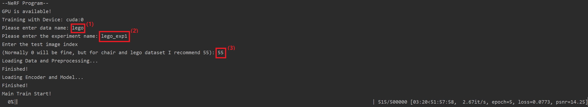
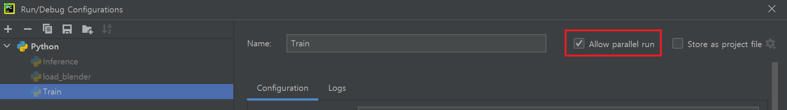
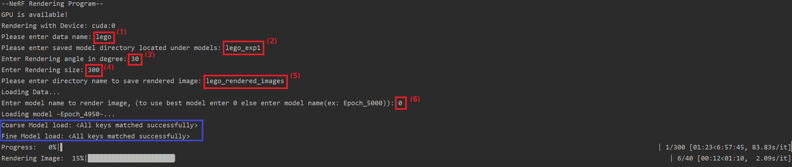

# **NeRF** PyTorch
### **NeRF**(Neural Radiance Fields) re-implementation with minimal code and maximal readability using PyTorch.

You can find original paper in [NeRF: Representing Scenes as Neural Radiance Fields for View Synthesis.](https://arxiv.org/abs/2003.08934) 

- - -

## Objective

Even though there are lots of NeRF implementation, including [official implementation](https://github.com/bmild/nerf), 
which is written in Tensorflow, and [pytorch implementation](https://github.com/yenchenlin/nerf-pytorch), the codes of that projects are quite hard to read and understand.
And it takes a lot of time and effort to fully digest the entire code. So our main purpose of this project is to **re-implement** the **official NeRF code** following 
three design goals. 

- Minimal Possible Code

- Maximize Readability

- Closely follow the overall structure of [original implementation](https://github.com/bmild/nerf), such that understanding this code will eventually help understanding the original code.

## Data

- We will use the data from official NeRF data repository.

- Go to the following [link](https://drive.google.com/drive/folders/128yBriW1IG_3NJ5Rp7APSTZsJqdJdfc1) and download ```nerf_synthetic``` folder. 
  - As I mentioned, our purpose is to accomodate readers to easily digest the code and thus to understand what is NeRF. So we just use ```nerf_synthetic``` data and this is enough to understand NeRF. 
Handling various kind of data will disturb our main objective. However, if there is some requests for handling other kinds of data, please let me know.

- Place the ```nerf_synthetic``` folder inside the main project directory.

## Result

Before proceeding, we present final rendered images from out project.

 &nbsp; &nbsp; &nbsp;
 &nbsp; &nbsp; &nbsp;


Images are rendered at 30 degrees latitude.

If you want to see the results of other object, go to ```./image_README/final_gif/``` folder.

- - -

## Training

### Run ```Train.py```.

After running ```Train.py``` you will see prompt like the image below. There are total three inputs.



(1) Enter the data set name you want to train. 
  - If you look at the ```nerf_synthetic``` folder which you've downloaded, you will find that there are 8 data sets available. Namely, ```chair, drums, ficus, hotdog, lego, materials, mic, ship```. So the available input should be one of those 8 dataset name.

(2) Enter the experiment name. 
  - You can input any experiment name you want. This name will be used to generate subfolders to store images, models and log(tensorboard).

(3) Enter the test image number(0~199). 
  - What this number mean is that, if you look at the ```test``` folder for each of the data set folder,(ex:```./nerf_synthetic/lego/test/```) you can see there exist images like ```r_0.png, r_1.png, r_2.png ... r_199.png```. And the number you input will be the test image to compare with the image rendered during training by NeRF. So if you input number 55, ```r_55.png``` will be selected to be the test image. And during training, NeRF will use the information about camera's extrinsic(camera's position, camera's direction) values of ```r_55.png``` and render novel view image. And this rendered image will be saved under the folder ```./fine_Image/exp_name/``` and PSNR will be calculated with ```r_55.png```. That PSNR value will be stored as ```PSNR test``` in tensorboard.
  - You can use any number between 0 to 199, for chair and lego dataset, we recommend 55 because ```r_0.png```'s camera is facing back of the object.  
  
 :heavy_check_mark: If you are using multiple GPU's you will see additional prompt before (1) which is, ```please enter number (ex) 0 for cuda:0, 1 for cuda:1): ``` Enter the number you want to train with. If you want to run multiple experiments in parallel, use different gpu number for each experiment. For example, use ```cuda:0``` for training NeRF with ```lego``` data and use ```cuda:1``` for training NeRF with ```ship``` data.
  - If you are using ```PyCharm``` and want to run multiple excution, go to toolbar ```Run->Edit Configurations...``` and check the ```Allow parallel run``` and press Apply button. Consult below image.
  


Running ```Train.py``` you will see that 3 folders are generated inside the main project directory. 

1. ```fine_image/exp_name/```
  - Rendered novel view image by NeRF is stored. Name of the image consists two informations. First five digit number indicates the Epoch when this image were rendered. And the second number after undersocre is the PSNR between rendered image and the test image you selected in (3).

2. ```models/exp_name/```
  - Models are saved in this directory. With the format ```Epoch_xxx.tar```

3. ```runs/exp_name/```
  - Run ```tensorboard --logdir PATH_TO_PROJECT_DIRECTORY/runs``` and you will see the logs during training at ```http://localhost:6006/```
  
- - -

## Inference

### Run ```Inference.py```

After running ```Inference.py``` you will see prompt like the image below. There are total six inputs.



(1) Enter the data set name you want to render.
  - As in the training section, input must be one of ```chair, drums, ficus, hotdog, lego, materials, mic, ship``` which you've trained NeRF with.
 
(2) Enter the experiment name.
  - This name should be the same name which you used in training section. Since it will find the saved model in the folder ```./models/exp_name/```
  
(3) Enter Latitude angle you want to render.
  - Enter angle between (0~90). Latitude angle in **Result** section is 30 degree.
  
(4) Enter rendering size.
  - This is the number of total images to render. It will evenly seperate the longitude angle(0~360) with a given number. It takes about 1 minute to render one image in ```GTX1080Ti```. The program automatically finds fps to generate GIF with total 5 seconds to fully rotate in space. So for example, if the rendering size is 60, then the fps will be 5fps. The GIF in **Result** section was rendered with **300 rendering size**. More than 300 rendering size will generate GIF which takes more than 5 seconds to fully rotate in space, since the maximum fps is fixed to 60fps.
