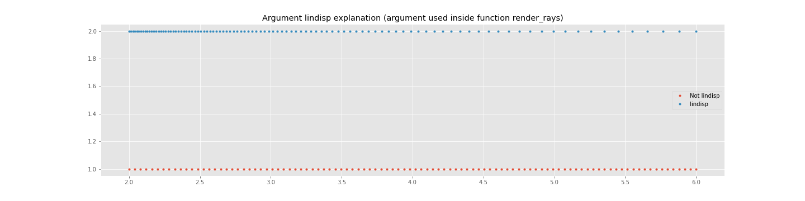

# **NeRF** PyTorch
### **NeRF**(Neural Radiance Fields) re-implementation with minimal code and maximal readability using PyTorch.

You can find original paper in [NeRF: Representing Scenes as Neural Radiance Fields for View Synthesis.](https://arxiv.org/abs/2003.08934) 

- - -

## Objective

Even though there are lots of NeRF implementation, including [official implementation](https://github.com/bmild/nerf), 
which is written in Tensorflow, and [pytorch implementation](https://github.com/yenchenlin/nerf-pytorch), the codes of that projects are quite hard to read and understand.
And it takes a lot of time and effort to fully digest the entire code. So our main purpose of this project is to **re-implement** the **official NeRF code** following 
three design goals. 

- Minimal Possible Code

- Maximize Readability

- Closely follow the overall structure of [original implementation](https://github.com/bmild/nerf), such that understanding this code will eventually help understanding the original code.

## Data

- We will use the data from official NeRF data repository.

- Go to the following [link](https://drive.google.com/drive/folders/128yBriW1IG_3NJ5Rp7APSTZsJqdJdfc1) and download ```nerf_synthetic``` folder. 
  - As I mentioned, our purpose is to accomodate readers to easily digest the code and thus to understand what is NeRF. So we just use ```nerf_synthetic``` data and this is enough to understand NeRF. 
Handling various kind of data will disturb our main objective. However, if there is some requests for handling other kinds of data, please let me know.

- Place the ```nerf_synthetic``` folder inside the main project directory.

## Result

Before proceeding, we present final rendered images from out project.

 &nbsp; &nbsp; &nbsp;
 &nbsp; &nbsp; &nbsp;


Images are rendered at 30 degrees latitude.

If you want to see the results of other object, go to ```./image_README/final_gif/``` folder.

Other additional fascinating GIF can be found at [Additionals section](#additionals)

### For those of you, who wants to use pretrained model to render images like above right away, go to following [section.](#use-pretrained-model-right-away)

- - -

## Training

### Run ```Train.py```.

After running ```Train.py``` you will see prompt like the image below. There are total three inputs.


(1) Enter the data set name you want to train. 
  - If you look at the ```nerf_synthetic``` folder which you've downloaded, you will find that there are 8 data sets available. Namely, ```chair, drums, ficus, hotdog, lego, materials, mic, ship```. So the available input should be one of those 8 dataset name.

(2) Enter the experiment name. 
  - You can input any experiment name you want. This name will be used to generate subfolders to store images, models and log(tensorboard).

(3) Enter the test image number(0~199). 
  - What this number mean is that, if you look at the ```test``` folder for each of the data set folder,(ex:```./nerf_synthetic/lego/test/```) you can see there exist images like ```r_0.png, r_1.png, r_2.png ... r_199.png```. And the number you input will be the test image to compare with the image rendered during training by NeRF. So if you input number 55, ```r_55.png``` will be selected to be the test image. And during training, NeRF will use the information about camera's extrinsic(camera's position, camera's direction) values of ```r_55.png``` and render novel view image. And this rendered image will be saved under the folder ```./fine_Image/exp_name/``` and PSNR will be calculated with ```r_55.png```. That PSNR value will be stored as ```PSNR test``` in tensorboard.
  - You can use any number between 0 to 199, for chair and lego dataset, we recommend 55 because ```r_0.png```'s camera is facing back of the object.  
  
 :heavy_check_mark: If you are using multiple GPU's you will see additional prompt before (1) which is, ```please enter number (ex) 0 for cuda:0, 1 for cuda:1): ``` Enter the number you want to train with. If you want to run multiple experiments in parallel, use different gpu number for each experiment. For example, use ```cuda:0``` for training NeRF with ```lego``` data and use ```cuda:1``` for training NeRF with ```ship``` data.
  - If you are using ```PyCharm``` and want to run multiple excution, go to toolbar ```Run->Edit Configurations...``` and check the ```Allow parallel run``` and press Apply button. Consult below image.
  


Running ```Train.py``` you will see that 3 folders are generated inside the main project directory. 

1. ```fine_image/exp_name/```
  - Rendered novel view image by NeRF is stored. Name of the image consists two informations. First five digit number indicates the Epoch when this image were rendered. And the second number after undersocre is the PSNR between rendered image and the test image you selected in (3).

2. ```models/exp_name/```
  - Models are saved in this directory. With the format ```Epoch_xxx.tar```

3. ```runs/exp_name/```
  - Run ```tensorboard --logdir PATH_TO_PROJECT_DIRECTORY/runs``` and you will see the logs during training at ```http://localhost:6006/```
  
- - -

## Inference

### Run ```Inference.py```

After running ```Inference.py``` you will see prompt like the image below. There are total six inputs.


(1) Enter the data set name you want to render.
  - As in the training section, input must be one of ```chair, drums, ficus, hotdog, lego, materials, mic, ship``` which you've trained NeRF with.
 
(2) Enter the experiment name.
  - This name should be the same name which you used in training section. Since it will find the saved model in the folder ```./models/exp_name/```
  
(3) Enter Latitude angle you want to render.
  - Enter angle between (0~90). Latitude angle in **Result** section is 30 degree.
  
(4) Enter rendering size.
  - This is the number of total images to render. It will evenly seperate the longitude angle(0~360) with a given number. It takes about 1 minute to render one image in ```GTX1080Ti```. The program automatically finds fps to generate GIF with total 5 seconds to fully rotate in space. So for example, if the rendering size is 60, then the fps will be 5fps. The GIF in **Result** section was rendered with **300 rendering size**. More than 300 rendering size will generate GIF which takes more than 5 seconds to fully rotate in space, since the maximum fps is fixed to 60fps. Those of you, who wants more than 60 fps go to [code](https://github.com/sillsill777/NeRF-PyTorch/blob/4847d7381c7445cb7908c7ffad1652f2a4fe5074/Inference.py#L79) and change the fps.
  
(5) Enter file name to save rendered images.
  - Rendered images will be saved under ```rendered_Image/FILE_NAME_YOU_ENTERED/```. After the program ends, the ```final.gif``` is the GIF made with the rendered images.
  
(6) Enter the model name to render image.
  - After training there will be lots of saved model in ```models/exp_name/```. You can choose the specific model to render image. For example if you want to render images with the saved model parameter ```Epoch_100.tar```, enter ```Epoch_100``` in prompt. If you just want to use the model with the best ```PSNR_test``` achieved, enter **0**
  - If you see the blue box, it means that the model is successfully loaded.
  
:heavy_check_mark: As in the **Training** section, if you are using mutiple gpus, you can facilitate it to render images with different type of object or differnet latitude angle in parallel. For the detail, consult the above **Training** section.

### Use Pretrained model right away!

- Pretrained models are provided in folder ```./models/```. Currently 7 objects are trained using NeRF, ```chair, drums, hotdog, lego, materials, mic, ship``` as you can see in the ```models/``` folder. 
- ```ship_half``` is the model trained with half resolution(400X400 size) of the images of ship. For the ```ship_half``` model, you have to change the ```half_res``` parameter which is located inside ```Config.py``` to ```True```, [link](https://github.com/sillsill777/NeRF-PyTorch/blob/a9dd36186ee6f13b465c8a0f2a8248d70419d960/Config.py#L15) is here.
- Go to [Inference section](#inference) and follow the steps. Only **difference** is that at **step (2)**, when entering the experiment name, you have to input one of the following, ```chair, drums, hotdog, lego, materials, mic, ship, ship_half``` and at **step (6)**, just input **0** to the prompt.
 
 ## Configure
 
 In this section, I will explain some parameters inside the ```Config.py```. We tried to follow same terminolory used in original implementation.
 
 :pushpin: ```half_res``` : Whether to use half resoultion image to train NeRF and render image. Original data set image size is 800X800, setting ```True``` will train on image with 400X400 size.
 
 :pushpin: ```chunk``` : The size of the ray which is rendered simultaneously. Is is only meaningful parameter where full image is rendered. For example, in ```Inference.py``` or the rendering one test image step in ```Train.py```. Let'a assume we are training with ```half_res=False```, then there will be total 800x800=640k rays to be rendered to make one full image. Since rendering 640k rays simultaneously requires enormous amount of memory(which is not possible with normal GPU devices) we have to chunk rays into small pieces such that to fit in GPU memory. So if the chunk size is 1000, then 1000 rays will be rendered simultaneously and there will be total 640 rendering step. So the chunk size is directly related to the speed of rendering one full image.
 
 ### If you are getting OOM(out of memory) problem during ```Inference``` or rendering test image, try to reduce the size of ```chunk``` parameter. Normally, 1024*16 will be enough to fit in to your device.
 
:pushpin:  ```networkChunk``` : The number of points to be passed to the NeRF's MLP model. So for example networkChunk is 10000, then 10000 points will be processed simultaneously in the MLP's forward function. Let's assume ```chunk``` is 1000 and sampling number of points per ray is 250. Then there will be total 1000*250=250,000 points. Since networkChunk is 10,000 the forward pass of MLP will be invoked 25 times in one train step.
 
 ### If you are getting OOM problem during training, try to reduce the size of ```networkChunk```. If you follow default settings, normally, there should be no memory problem.
 
 :pushpin: ```totalSteps``` : The number of total steps for training. Default value, following original implementation is 500,000. Unlike original implementation, we also use epoch notation. Since there are 100 images for each dataset, we define ```1 epoch = 100 steps```. So essentially, default epoch is 5,000.
 
 :pushpin: ```render_one_test_image_epoch``` : The interval to render test image during training. About the test image rendering, go to [Training section](#training) step (3).
 
 :pushpin: ```lPosition, lDirection``` : The number of positional encoding frequencies. Consult original paper section 5.1 Positional encoding. As in the paper, we set L=10 for position vector and L=4 for direction vector.
 
 :pushpin: ```Nc, Nf``` : The number of sampling point along ray with Coarse network and Fine network. Consult original paper section 5.3 Implementation details and Appendix A. As in the paper, we set Nc=64, Nf=128.
 
 :pushpin: ```N_rand``` : The number of rays randomly sampled from one training image. During training step, we randomly select ```N_rand``` rays from total 640k rays for training. This is why I mentioned ```chunk``` parameter is only meanigful where full image is rendered. In the original implementation, the author used ```N_rand``` = 1024 for ```nerf_synthetic``` data.
 
 :pushpin: ```preCrop_iter, preCrop_rate``` : For the first ```preCrop_iter```, we just not randomly sample ```N_rand``` rays, rather we randomly sample rays inside the bounded region where width and height are ```preCrop_rate X (width, height of original image)``` with center aligned. For example, assume ```preCrop_iter=5000, preCrop_rate=0.5``` than for the first 5000 steps, it randomy samples ```N_rand``` rays from the region with (400X400 size)bounded box, center aligned.  
 
 :pushpin: ```lr_decay``` : Exponential learning rate decay in 1000 steps.
 
 :pushpin: ```perturb``` : Whether to add randomness in sampling points for Coarse network and in inverse tranform sampling, which is the technique used to sample points for Fine network.
 
 :pushpin: ```lindsip``` : This is related to sampling schema. This parameter is better explained in image than word.
 
 Near is set to 2 and Far is set to 6. As you can see, setting ```lindisp=True``` will sample more points near the Near plane. While ```lindisp=False``` will evenly sample point between near and far plane. Default is False.
 
- - -

# Additionals

## Training Progress

We present some Gif which is composed of NeRF generated test images, during training. Test images are rendered every 50 epochs. You can see the improvment of image quailty as the train progress.

 &nbsp; &nbsp; &nbsp;
 &nbsp; &nbsp; &nbsp;


For the other objects, go to ```./image_README/progress_image/```

## Various Latitude Angle

 &nbsp; &nbsp; &nbsp;
 &nbsp; &nbsp; &nbsp;


(Left: 0 degree latitude, Middle: 30 degrees latitude, Right: 60 degrees latitude)

## Additional GIF

 &nbsp; &nbsp; &nbsp;
 &nbsp; &nbsp; &nbsp;


(Rendered at 30 degrees latitude)

